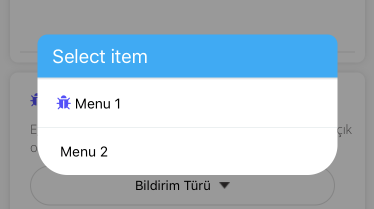

# react-native-mkmenu
Cross platform modal menu.



# Installation

```
npm i react-native-mkmenu --save
```
# Props


| Prop     | Type | Default   |
| :------- | ----: | :---: |
| modalTitle | string |  Select item   |
| visible    | boolean   |  false  |
| data    | object   |    |
| onPress     | function    |  ```(index,menuTitle) => console.log('Selected: ' + menuTitle)```  |

# Usage

Firstly include module in projecT
```
import MKMenu from 'react-native-mkmenu';
```
then,

```javascript
<MKMenu
  modalTitle={"Plase select item"}
  visible={true}
  data={[
  {menuTitle:"Menu 1",menuIcon:<Icon name={'bug'} size={64} color="#5349fc"/>},
  {menuTitle:"Menu 2"},
  {menuTitle:"Menu 3"}
  ]}
  onPress={ (index,menuTitle) => alert("Selected: " + menuTitle) }
/>
```
